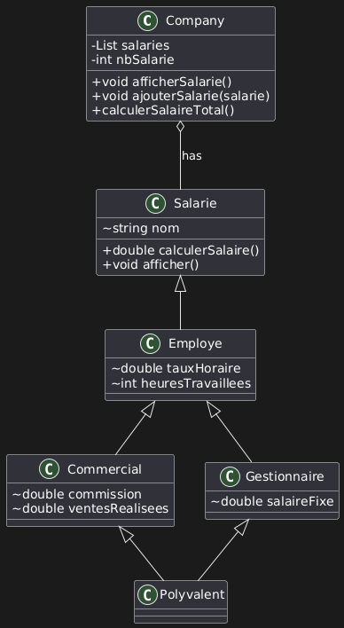

## Intro
Made using CMake.

## classes

- **Company**: Contain a list of salaries, why the `uniquePtr`? because each employee can only work for one company.
- **Salarie**: This class should be abstract. However, considering the logic behind its creation (`calculerSalaire()` in Employer is not purely virtual because we can calculate the salary from the hourly rate and hours worked), the `afficher()` method in Salarie cannot be purely virtual since we know the employee's name and can identify them by it. Therefore, **Salarie** cannot be purely virtual.

- **Commercial**, **Employe**, **Gestionnaire**: These classes use virtual inheritance to solve the `Deadly Diamond of Death` (as described on Wikipedia). Other details are self-explanatory and follow the exercise instructions.

- **Polyvalent**: This class demonstrates the `diamond problem`, which occurs when a class inherits from two classes that have a common base class. In this case, `Polyvalent` inherits from both `Commercial` and `Gestionnaire`, which both inherit from `Employe`. This can lead to ambiguity in the inheritance hierarchy, but it is resolved using virtual inheritance.
